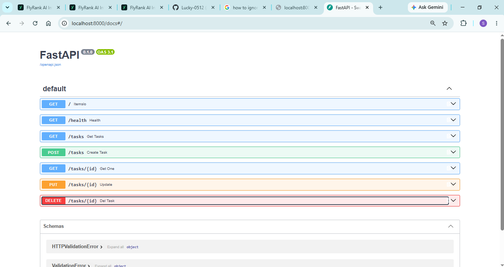
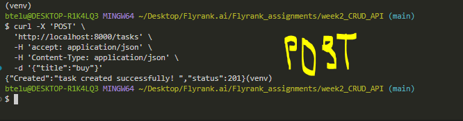

# FastAPI Task API

A simple **Task Management REST API** built with **FastAPI** and **Pydantic**.

This project was built while learning FastAPI and covers the fundamentals of API development, including routing, request handling, Pydantic validation, and complete CRUD operations.

---

## What is this?

This is a basic **Task API** that allows you to:

* Create tasks
* View all tasks
* View a specific task
* Update a task
* Delete a task
* Check whether the API is running

For now, the tasks are stored in a simple Python list (`memory`), so the data will be reset whenever the server restarts.

---

## Tech Stack

* **Python**
* **FastAPI** — API framework
* **Pydantic** — request data validation
* **Uvicorn** — ASGI server
* **In-memory Python list** — temporary data storage

---

## Installation

Clone the project and install the required dependencies:

```bash
pip install fastapi uvicorn
```

---

## Run the API

If your main file is called `main.py`, run:

```bash
uvicorn main:app --reload
```

That's it.

The API will be available at:

```text
http://127.0.0.1:8000
```

### Interactive API Documentation

FastAPI automatically generates Swagger documentation:

```text
http://127.0.0.1:8000/docs
```

You can use this page to test all the endpoints directly from your browser.

---

# API Endpoints

| Method   | Endpoint      | Description         |
| -------- | ------------- | ------------------- |
| `GET`    | `/`           | Get API information |
| `GET`    | `/health`     | Check API health    |
| `GET`    | `/tasks`      | Get all tasks       |
| `GET`    | `/tasks/{id}` | Get a specific task |
| `POST`   | `/tasks`      | Create a new task   |
| `PUT`    | `/tasks/{id}` | Update a task       |
| `DELETE` | `/tasks/{id}` | Delete a task       |

# CRUD Overview
The API now supports the complete CRUD cycle:

| CRUD Operation | HTTP Method | Endpoint      |
| -------------- | ----------- | ------------- |
| **Create**     | `POST`      | `/tasks`      |
| **Read**       | `GET`       | `/tasks`      |
| **Read One**   | `GET`       | `/tasks/{id}` |
| **Update**     | `PUT`       | `/tasks/{id}` |
| **Delete**     | `DELETE`    | `/tasks/{id}` |

So the basic flow is:

```text
Client
   ↓
HTTP Request
   ↓
FastAPI Route
   ↓
Pydantic Validation
   ↓
In-Memory Task List
   ↓
HTTP Response
```

---

## Current Storage

At the moment, the project uses:

```python
memory: list[dict] = [...]
```



