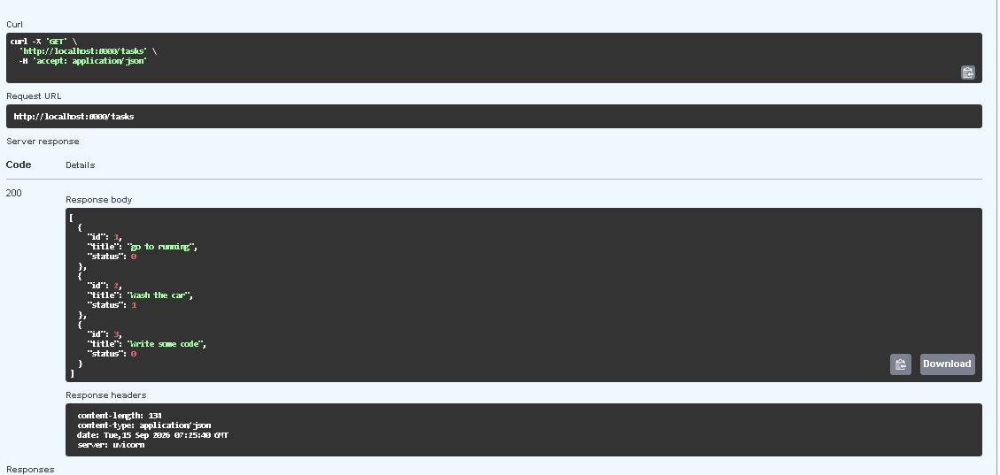
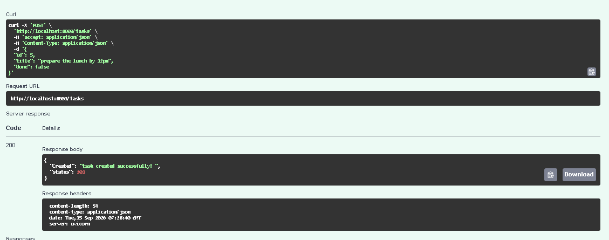
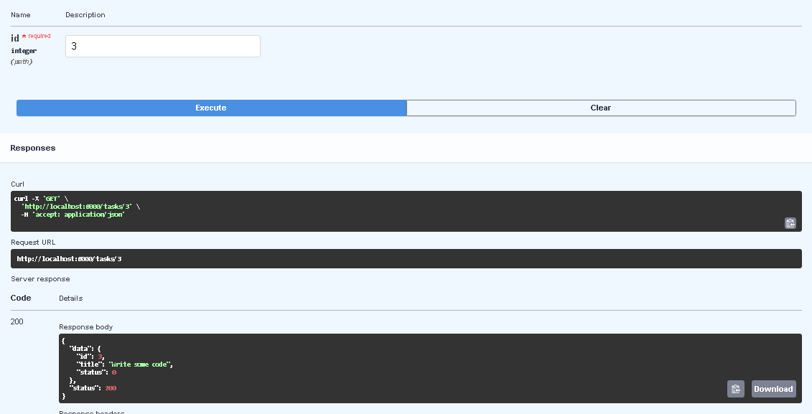
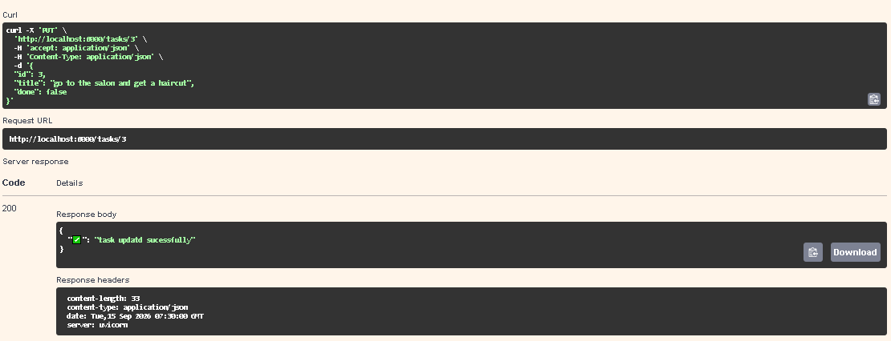
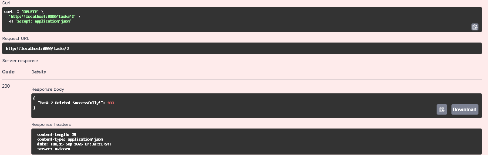

# FastAPI Task Management API

A simple CRUD API built with **FastAPI** and **SQLite** for managing tasks.

This project demonstrates how a FastAPI application can interact with a SQLite database to perform basic CRUD operations.

---

## 🛠️ Technologies Used

- Python
- FastAPI
- Pydantic
- SQLite
- Uvicorn

---

## 📁 Project Structure

```text
week3_connecting_db/
│
├── app_db.py
├── tasks.db
│
├── readme.md
├── stage4_testing_manually_inDB_rowser.md
│
├── image.png
├── image-1.png
├── image-2.png
├── image-3.png
├── image-4.png
│
└── __pycache__/
```

### Important Files

- `app_db.py` — Main FastAPI application.
- `tasks.db` — SQLite database containing the `tasks` table.
- `stage4_testing_manually_inDB_rowser.md` — Documentation of manual SQL/database-browser testing.
- `image.png` through `image-4.png` — Screenshots from the database-browser testing.

---

# 🗄️ Why SQLite?

SQLite was chosen for this project because it is simple and lightweight, making it well suited for a small learning project.

SQLite also comes built into Python through the standard `sqlite3` module. This means that a separate database server does not need to be installed or configured.

Using SQLite also provides a good way to learn fundamental SQL and database operations while keeping the project simple.

---

# 💾 Database

The project uses a SQLite database named:

```text
tasks.db
```

The database file is stored directly in the project directory.

The `tasks` table is created automatically by the application when the project starts:

```sql
CREATE TABLE IF NOT EXISTS tasks(
    id INTEGER PRIMARY KEY,
    title TEXT NOT NULL,
    status BOOLEAN DEFAULT FALSE
);
```

### Tasks Table

| Column | Type | Description |
|---|---|---|
| `id` | INTEGER | Unique task ID |
| `title` | TEXT | Task title |
| `status` | BOOLEAN | Task completion status |

---

# ▶️ How to Start the Project

## 1. Clone the repository

```bash
git clone <YOUR_REPOSITORY_URL>
cd week3_connecting_db
```

## 2. Create a virtual environment

### Linux / macOS

```bash
python3 -m venv venv
source venv/bin/activate
```

### Windows

```powershell
python -m venv venv
venv\Scripts\activate
```

## 3. Install the required packages

```bash
pip install fastapi uvicorn
```

## 4. Start the FastAPI application

```bash
uvicorn app_db:app --reload
```

The API will be available at:

```text
http://127.0.0.1:8000
```

FastAPI's interactive Swagger documentation can be accessed at:

```text
http://127.0.0.1:8000/docs
```

---

# 🔌 API Endpoints

The application currently supports the following CRUD endpoints:

| Method | Endpoint | Description |
|---|---|---|
| `GET` | `/tasks` | Get all tasks |
| `POST` | `/tasks` | Create a task |
| `GET` | `/tasks/{id}` | Get one task |
| `PUT` | `/tasks/{id}` | Update a task |
| `DELETE` | `/tasks/{id}` | Delete a task |

---

## 1. Get All Tasks

### `GET /tasks`

Returns all tasks stored in the SQLite database.



## 2. Create a Task

### `POST /tasks`

Creates a new task.




## 3. Get One Task

### `GET /tasks/{id}`

Returns a specific task using its ID.


## 4. Update a Task

### `PUT /tasks/{id}`

Updates an existing task.



## 5. Delete a Task

### `DELETE /tasks/{id}`


# 📖 Swagger UI

FastAPI automatically generates interactive API documentation using Swagger UI.

Open the following URL after starting the application:

```text
http://127.0.0.1:8000/docs
```

The Swagger UI provides an interface for testing all five API endpoints.
# 🧪 Database Browser Testing

The SQLite database was also tested manually using a database browser.

These tests were performed directly on the database to understand how SQL queries can be used to read, filter, count, update, and delete records.

The following operations were tested:

### 1. List Every Task

```sql
SELECT * FROM tasks;
```


---

### 2. Show Only Completed Tasks


---

### 3. Count All Tasks


---

### 4. Mark Every Task as Completed


---

### 5. Delete All Completed Tasks


---

The complete manual database-testing process is documented in:

[`stage4_testing_manually_inDB_rowser.md`](./stage4_testing_manually_inDB_rowser.md)

---

# 🔄 CRUD Flow

The application follows this basic flow:

```text
Client
   │
   ▼
FastAPI Endpoint
   │
   ▼
Python / Pydantic
   │
   ▼
SQLite SQL Query
   │
   ▼
tasks.db
   │
   ▼
API Response
```

The CRUD operations are mapped to the API as:

```text
CREATE → POST   /tasks
READ   → GET    /tasks
READ   → GET    /tasks/{id}
UPDATE → PUT    /tasks/{id}
DELETE → DELETE /tasks/{id}
```

---

# 🧩 Pydantic Validation

Incoming task data is validated using a Pydantic model.

The application defines the following model:

```python
class entry(BaseModel):
    id: int
    title: str
    done: bool | None = False
```

This allows the application to validate the basic structure and data types of incoming JSON requests.

---

# 🗃️ Automatic Database Creation

One of the goals of this project is that a developer cloning the repository should be able to run the application without manually creating the database.

When the application starts:

1. It checks whether `tasks.db` exists.
2. If it does not exist, the database file is created.
3. The `tasks` table is created using `CREATE TABLE IF NOT EXISTS`.
4. If the table is empty, three example tasks are inserted.

This means that a separate database setup step is not required for the basic application to run.


# 📌 Project Status

**CRUD implementation complete.**

The API currently supports:

```text
CREATE → POST
READ   → GET
UPDATE → PUT
DELETE → DELETE
```

with SQLite being used as the database.

---

## Stage 5 — Database Documentation

This stage documents:

- Why SQLite was chosen
- Where the database is stored
- How to start the project
- Swagger UI usage
- Manual database-browser testing
- Example SQL queries executed against the database

**Commit:**

```text
Stage 5: database documentation
```