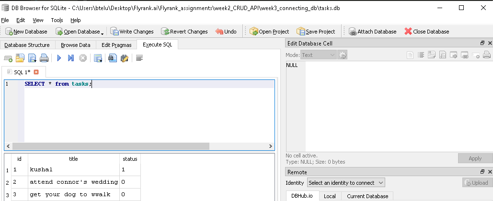
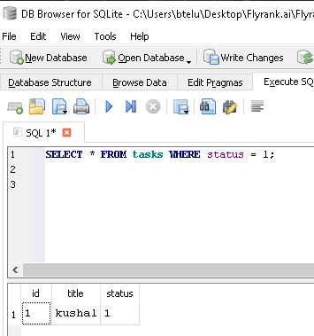
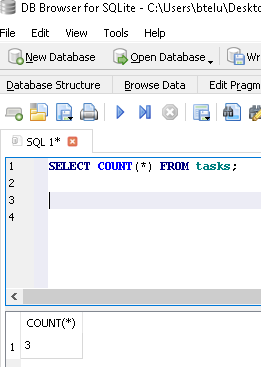
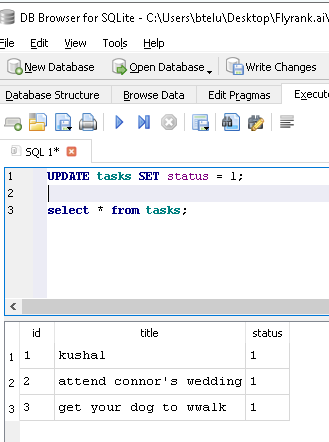
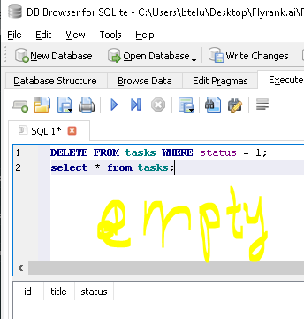

##Stage 4 — Learn your first SQL

### List every task:

### Show only completed tasks:    

### Count all tasks:

### Mark every task as completed:

### Delete all completed tasks:

## finshed stage 4.
